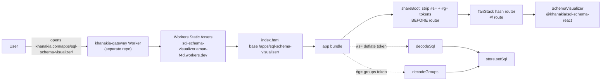

# @khanakia/sql-schema-web — the SQL Schema Visualizer app

The deployed single-page app behind **[khanakia.com/apps/sql-schema-visualizer/](https://khanakia.com/apps/sql-schema-visualizer/)**. A thin consumer of [`@khanakia/sql-schema-react`](../react) — it owns the router, share-link URL handling, and the Cloudflare Workers Static Assets deploy.

> Free, fast, 100% client-side database schema visualizer. Paste PostgreSQL / MySQL / SQLite / ANSI DDL → interactive ER diagram. No backend, no signup, nothing leaves the browser.

---

## Run locally

From the **repo root** (pnpm workspace):

```bash
pnpm install
pnpm dev           # → @khanakia/sql-schema-web dev server
pnpm build         # build libs + app
pnpm preview       # serve the production build
task deploy:cf     # build + deploy to Cloudflare (Workers Static Assets; needs CLOUDFLARE_API_TOKEN in .env)
```

Or use the workspace `Taskfile.yml`: `task --list` shows every task (`dev`, `build`, `build:cf`, `deploy:cf`, `test`, `test:watch`, `typecheck`, `check`, …).

The app **bundles `@khanakia/sql-schema-core` and `@khanakia/sql-schema-react` from source** (Vite alias), so Tailwind scans the component classes and HMR works across packages — no library rebuild needed during development.

## How requests flow



Key app-only decisions:

- **Hash routing** (`createHashHistory`) — works under the `/apps/sql-schema-visualizer/` Cloudflare sub-path with no server rewrites and no SPA 404 hacks.
- **Share links** live in the URL **fragment** (`#s=<token>` for SQL + optional `&g=<token>` for groups), never the query string — fragments aren't sent to the server, so large schemas don't hit `414 URI Too Long`. `shareBoot.ts` strips both tokens *synchronously before the router mounts* so there's no "Not Found" flash.
- **SEO**: `index.html` ships title, description, robots, canonical (`https://khanakia.com/apps/sql-schema-visualizer/`), Open Graph + Twitter card with `og.png`, a JSON-LD `@graph` (SoftwareApplication + Organization + WebSite + BreadcrumbList), and a prerendered crawl/no-JS hero inside `#root` that React replaces on mount. `public/sitemap.xml` is shipped under the base path.

## Deploy

Production deploy is **Cloudflare Workers Static Assets** under `khanakia.com/apps/sql-schema-visualizer/`, fronted by the `khanakia-gateway` Worker (a separate private repo, KV-routed reverse proxy). Manual deploy from a workstation:

```bash
cd /path/to/sql-schema-visualizer
cp .env.example .env       # paste a CLOUDFLARE_API_TOKEN (account-scoped)
task deploy:cf             # build:cf nests dist under apps/sql-schema-visualizer/ + wrangler deploy
```

`build:cf` is `vite build` plus a `cp` step that nests the output under `dist-cf/apps/sql-schema-visualizer/` to match the Vite `base` and the public URL prefix. `apps/web/wrangler.jsonc` is the deploy config; `apps/web/public/sitemap.xml` ships with the build.

The legacy `.github/workflows/deploy.yml` (GitHub Pages) is preserved in the repo as a fallback; the canonical URL is non-www `khanakia.com/apps/sql-schema-visualizer/`.

## License

[MIT](../../LICENSE) © khanakia
