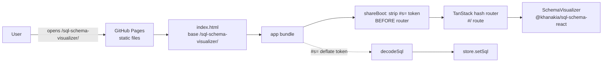
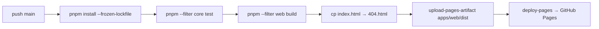

# @khanakia/sql-schema-web — the SQL Schema Visualizer app

The deployed single-page app behind **[khanakia.github.io/sql-schema-visualizer](https://khanakia.github.io/sql-schema-visualizer/)**. A thin consumer of [`@khanakia/sql-schema-react`](../react) — it owns only the router, the share-link URL handling, and the GitHub Pages deploy.

> Free, fast, 100% client-side database schema visualizer. Paste PostgreSQL / MySQL / SQLite / ANSI DDL → interactive ER diagram. No backend, no signup, nothing leaves the browser.

---

## Run locally

From the **repo root** (pnpm workspace):

```bash
pnpm install
pnpm dev          # → @khanakia/sql-schema-web dev server
pnpm build        # build libs + app
pnpm preview      # serve the production build
```

The app **bundles `@khanakia/sql-schema-core` and `@khanakia/sql-schema-react` from source** (Vite alias), so Tailwind scans the component classes and HMR works across packages — no library rebuild needed during development.

## How requests flow



Key app-only decisions:

- **Hash routing** (`createHashHistory`) — works under the `/sql-schema-visualizer/` GitHub Pages sub-path with no server rewrites and no SPA 404 hacks.
- **Share links** live in the URL **fragment** (`#s=<token>`), never the query string — fragments aren't sent to the server, so large schemas don't hit `414 URI Too Long`. `shareBoot.ts` strips the token *synchronously before the router mounts* so there's no "Not Found" flash.
- **SEO**: `index.html` ships title, description, canonical, Open Graph + Twitter card with `og.png` so links unfurl with a preview.

## Deploy

`.github/workflows/deploy.yml` runs on push to `main`:



Tests gate the deploy: a failing `@khanakia/sql-schema-core` test blocks release.

## License

[MIT](../../LICENSE) © khanakia
