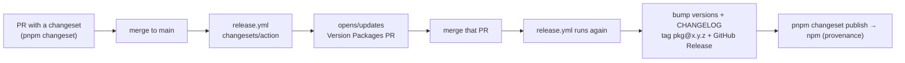

# Publishing

`@khanakia/sql-schema-core` and `@khanakia/sql-schema-react` are released to npm with **[Changesets](https://github.com/changesets/changesets)** — the same flow [vercel/ai](https://github.com/vercel/ai/tags) uses. The web app (`apps/web`) is `private` / ignored and never published; it deploys to GitHub Pages separately.

Tags are **per-package, no leading `v`** — e.g. `@khanakia/sql-schema-core@0.2.0`, `@khanakia/sql-schema-react@0.2.0`.

## The flow



1. **Make a change** in a PR. Record it:
   ```
   pnpm changeset        # or: task changeset
   ```
   Pick the bumped packages and patch/minor/major, write a one-line summary. This adds a `.changeset/*.md` file — commit it with your PR.
2. **Merge the PR to `main`.** `release.yml` (Changesets action) opens or updates a **"Version Packages"** PR that applies all pending changesets (version bumps + `CHANGELOG.md`).
3. **Merge the "Version Packages" PR.** The action then:
   - tags each package `@khanakia/sql-schema-core@x.y.z` etc.,
   - creates a **GitHub Release** per package,
   - runs `pnpm run release` → `build:libs` + `changeset publish` → publishes to **npm with provenance**.

No manual version edits, no manual tags. `react`'s `workspace:*` dep on `core` is rewritten to the published version automatically.

## One-time setup (done)

- **npm Automation token** → repo secret `NPM_TOKEN`. Must be a **Classic Automation** token (Account → Access Tokens → *Classic Token* → **Automation**). Granular / Publish tokens fail in CI with `npm error code EOTP — requires a one-time password`.
  ```
  gh secret set NPM_TOKEN --repo khanakia/sql-schema-visualizer
  ```
- **Repo setting** (required for the Version Packages PR): Settings → Actions → General → *Workflow permissions* → enable **"Allow GitHub Actions to create and approve pull requests"**.
- Both libs declare `publishConfig.access: public` + repository/homepage/bugs; `.changeset/config.json` ignores `@khanakia/sql-schema-web`.

## Current state

`@khanakia/sql-schema-core@0.1.0` and `@khanakia/sql-schema-react@0.1.0` are already published (initial manual release, with provenance). All subsequent releases go through the Changesets flow above.

## Manual / local fallback

If the action is unavailable:

```
npm login                       # account in the @khanakia org
pnpm changeset version          # apply changesets → bump + changelog
pnpm run release                # build:libs + changeset publish
git push --follow-tags
```

(`task publish:local` does the build + `changeset publish` part.)

## Verify

```
npm view @khanakia/sql-schema-core version
npm view @khanakia/sql-schema-react version
```
or <https://www.npmjs.com/settings/khanakia/packages>. New-scope packages can take a few minutes to appear on the read replica even though `npm publish` succeeded — `npm pack <pkg>@<version>` is the authoritative check.

## Versioning policy

Independent per-package SemVer (Changesets default). Pre-1.0: minor = features, patch = fixes, breaking allowed in minors. CHANGELOGs are generated from changeset summaries via `@changesets/changelog-github`.
