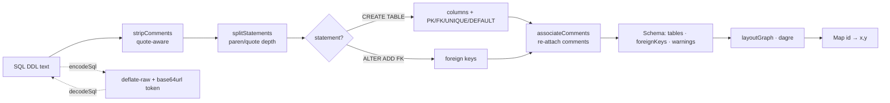

# @khanakia/sql-schema-core

**Framework-agnostic SQL database schema parser, ER-diagram layout engine, and URL share codec.** Zero React. Zero backend. Pure TypeScript that runs in Node, browsers, edge runtimes and web workers — the engine behind [SQL Schema Visualizer](https://khanakia.github.io/sql-schema-visualizer/).

[](#api) [-green)](#) [](#)

> Parse PostgreSQL / MySQL / SQLite / ANSI `CREATE TABLE` DDL into a typed schema model, lay it out as a graph, and compress a whole schema into a shareable URL token — all client-side.

---

## Why

Most SQL parsers are single-dialect, strict, and throw on the first vendor clause they don't recognise (`ENGINE=InnoDB`, `AUTOINCREMENT`, backticks). `@khanakia/sql-schema-core` is **deliberately tolerant**: it skips what it can't understand and still produces a useful diagram, surfacing problems as `warnings[]` instead of exceptions. Perfect for visualizers, docs generators, migration tools, lint rules, and LLM pipelines.

## Install

```bash
npm i @khanakia/sql-schema-core
# or: pnpm add @khanakia/sql-schema-core
```

ESM-only, ships its own `.d.ts`. Only runtime dependency: `@dagrejs/dagre`.

## Quick start

```ts
import { parseSchema, layoutGraph, encodeSql, decodeSql } from '@khanakia/sql-schema-core'

const sql = `
  CREATE TABLE customers ( id SERIAL PRIMARY KEY, email VARCHAR(255) NOT NULL UNIQUE );
  CREATE TABLE orders (
    id SERIAL PRIMARY KEY,
    customer_id INTEGER NOT NULL REFERENCES customers(id)
  );
`

const schema = parseSchema(sql)
schema.tables           // [{ name:'customers', columns:[...] }, { name:'orders', ... }]
schema.foreignKeys      // [{ fromTable:'orders', fromColumn:'customer_id', toTable:'customers', toColumn:'id' }]
schema.warnings         // string[] — never throws

// Lay it out (framework-agnostic: ids in, positions out)
const positions = layoutGraph(
  schema.tables.map(t => ({ id: t.name, columns: t.columns.length })),
  schema.foreignKeys.map(fk => ({ source: fk.fromTable, target: fk.toTable })),
  { direction: 'LR' },
)
positions.get('orders') // { x, y }

// Shareable, compressed URL token (deflate-raw + base64url, ~2.9x on SQL)
const token = await encodeSql(sql)        // URL-fragment safe
const back  = await decodeSql(token)      // original SQL (or null)
```

## How it works



## API

### `parseSchema(sql: string): Schema`

Tolerant multi-dialect parser. Handles PostgreSQL, MySQL, SQLite and generic ANSI: backticks, `"quotes"`, `[brackets]`, schema-qualified names, `AUTO_INCREMENT`/`AUTOINCREMENT`, `UNSIGNED`, composite keys, inline + table-level `FOREIGN KEY`, `ALTER TABLE … ADD FOREIGN KEY`, and `--` / `#` / `/* */` comments. Never throws.

```ts
interface Schema { tables: Table[]; foreignKeys: ForeignKey[]; warnings: string[] }
interface Table  { name: string; columns: Column[]; comment?: string }
interface Column {
  name: string; type: string; nullable: boolean
  pk: boolean; unique: boolean
  fk?: { table: string; column: string }
  default?: string; comment?: string
}
interface ForeignKey { fromTable: string; fromColumn: string; toTable: string; toColumn: string }
```

### `layoutGraph(nodes, edges, options?): Map<string, Point>`

Directed-graph layout via dagre. Pure: takes `{ id, columns }[]` + `{ source, target }[]`, returns top-left `{ x, y }` per id. Cycles and self-references are handled (dagre breaks them for ranking, all edges preserved).

```ts
layoutGraph(nodes, edges, {
  direction?: 'LR' | 'TB',                       // default 'LR'
  collapsed?: Record<string, true>,              // ids rendered header-only
  commentsInline?: boolean,                      // taller height estimate
  sizes?: Map<string, { width; height }>,        // real measured sizes win
})
```

### `encodeSql(sql) / decodeSql(token)`

`Promise`-based, native `CompressionStream('deflate-raw')` + base64url — **zero deps, no WASM**, ~2.9× on SQL. Token is URL-fragment safe. `decodeSql` returns `null` for blank/garbage input.

### `samples: Sample[]`

Ready-made commented example schemas (e-commerce / blog / SaaS) for demos and tests.

## Supported SQL

| Dialect | Notes |
|---|---|
| PostgreSQL | `SERIAL`, `TIMESTAMPTZ`, schema prefixes, array types |
| MySQL | backticks, `AUTO_INCREMENT`, `ENGINE=`, `UNSIGNED` |
| SQLite | `AUTOINCREMENT`, minimal types |
| ANSI / generic | best-effort; unknown clauses skipped, not fatal |

## Limitations

Not a full SQL grammar. Generated columns, partition clauses, deeply nested parens and CTE-in-DDL parse loosely. Comment continuation lines can anchor one row off. These are accepted trade-offs for a tolerant visual tool — see [CONTEXT.md](https://github.com/khanakia/sql-schema-visualizer/blob/main/CONTEXT.md).

## License

[MIT](https://github.com/khanakia/sql-schema-visualizer/blob/main/LICENSE) © khanakia · Part of [sql-schema-visualizer](https://github.com/khanakia/sql-schema-visualizer).
