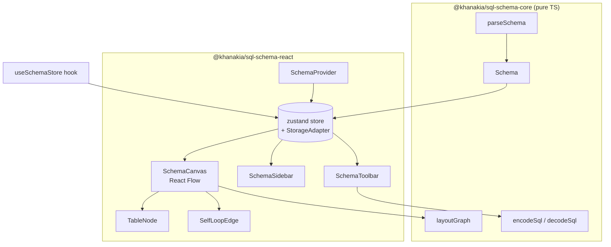

# @khanakia/sql-schema-react

**Composable React components for SQL database schema visualization.** Drop an interactive ER diagram into any React app — paste DDL, get tables, foreign-key edges, search, collapse, comments, theming, PNG export and shareable URLs. Built on [React Flow](https://reactflow.dev) and [`@khanakia/sql-schema-core`](https://www.npmjs.com/package/@khanakia/sql-schema-core).

[](https://react.dev) [](#) [](#)

> Live demo: **[khanakia.github.io/sql-schema-visualizer](https://khanakia.github.io/sql-schema-visualizer/)** — the demo app is itself a thin consumer of this package.

---

## Install

```bash
npm i @khanakia/sql-schema-react @khanakia/sql-schema-core @xyflow/react react react-dom
```

`react`, `react-dom` and `@xyflow/react` are **peer dependencies**. Import the stylesheet once:

```ts
import '@khanakia/sql-schema-react/styles.css'
```

## One line

```tsx
import { SchemaVisualizer } from '@khanakia/sql-schema-react'
import '@khanakia/sql-schema-react/styles.css'

export default function App() {
  return (
    <div style={{ height: '100vh' }}>
      <SchemaVisualizer sql="CREATE TABLE users ( id int PRIMARY KEY );" />
    </div>
  )
}
```

`<SchemaVisualizer>` props: `sql?`, `theme?: 'dark'|'light'`, `showSidebar?`, `showToolbar?`, `storage?`, `className?`.

## Compose your own

Every piece is exported so you control the layout entirely — sidebar, canvas and toolbar are independent and all read the shared store.

```tsx
import {
  SchemaProvider, SchemaCanvas, SchemaSidebar, SchemaToolbar,
  useSchemaStore,
} from '@khanakia/sql-schema-react'
import '@khanakia/sql-schema-react/styles.css'

function MyDiagram() {
  const tableCount = useSchemaStore(s => s.schema.tables.length)
  return (
    <SchemaProvider sql={mySql} theme="dark">
      <header>{tableCount} tables</header>
      <div style={{ display: 'flex', height: '90vh' }}>
        <SchemaSidebar />
        <div style={{ position: 'relative', flex: 1 }}>
          <SchemaCanvas showToolbar={false} />
          <SchemaToolbar onFit={() => {}} onExport={() => {}} />
        </div>
      </div>
    </SchemaProvider>
  )
}
```

## Architecture



## Public API

Three levels — use whichever fits:

| Export | What |
|---|---|
| `<SchemaVisualizer>` | one-line full app (provider + sidebar + canvas + toolbar) |
| `<SchemaProvider>` | context wrapper — drive `sql` / `theme` / `storage` from props |
| `<SchemaCanvas>` | the React Flow diagram — fully prop-configurable (see below) |
| `<SchemaSidebar>` | bundled panel; props `width` / `className` / `showHeader` |
| `<SchemaToolbar>` | bundled floating toolbar (`onFit`, `onExport`, `className`) |
| `<TableNode>` / `<SelfLoopEdge>` | renderers for custom React Flow setups |
| **Toolbar primitives** | `ToolbarButton` `ToolbarDivider` `SamplesMenu` `LayoutDirectionButton` `CollapseAllButton` `CommentModeButton` `ResetLayoutButton` `ThemeButton` `ShareButton` `FitButton` `ExportButton` |
| **Sidebar primitives** | `SchemaSearch` `SchemaWarnings` `TableList` `SqlImport` `CollapseSidebarButton` |
| `useSchemaStore` | full zustand store (sql, schema, search, focus, collapsed, theme, …) |
| `buildShareUrl`, `SHARE_URL_SOFT_LIMIT` | compressed share-link helpers |
| `setStorageAdapter`, `StorageAdapter` | pluggable persistence |
| re-exported core | `parseSchema`, `layoutGraph`, `encodeSql`, `decodeSql`, `samples`, types |

Every visible part is store-driven and layout-headless — drop primitives anywhere.

### `<SchemaCanvas>` props

| Prop | Type | Default | |
|---|---|---|---|
| `showToolbar` | `boolean` | `true` | bundled floating toolbar |
| `showMinimap` | `boolean` | `true` | minimap |
| `showControls` | `boolean` | `true` | zoom controls |
| `showBackground` | `boolean` | `true` | dotted background |
| `showHint` | `boolean` | `true` | pan/zoom hint chip |
| `minZoom` / `maxZoom` | `number` | `0.05` / `2.5` | zoom bounds |
| `fitViewPadding` | `number` | `0.15` | fit-view padding |
| `panOnScroll` | `boolean` | `true` | scroll pans (Figma-style) |
| `zoomOnScroll` | `boolean` | `false` | scroll zooms instead |
| `zoomOnDoubleClick` | `boolean` | `true` | |
| `panOnDrag` | `boolean` | `true` | |
| `onTableClick` | `(table: string) => void` | – | fires on node click |
| `className` / `style` | – | – | wrapper styling |
| `reactFlowProps` | `object` | – | **escape hatch** — spread onto the underlying `<ReactFlow>`, overrides any default |

### Build your own toolbar / sidebar

```tsx
import {
  SchemaProvider, SchemaCanvas,
  // toolbar primitives
  ToolbarButton, ToolbarDivider, SamplesMenu, LayoutDirectionButton,
  CommentModeButton, ResetLayoutButton, ThemeButton, ShareButton,
  // sidebar primitives
  SchemaSearch, TableList, SqlImport,
} from '@khanakia/sql-schema-react'

<SchemaProvider sql={mySql}>
  <aside style={{ width: 280 }}>
    <SchemaSearch placeholder="Find a table…" />
    <TableList />
    <SqlImport />
  </aside>

  <SchemaCanvas showToolbar={false} onTableClick={(t) => log(t)} />

  <div className="my-toolbar">
    <SamplesMenu />
    <ToolbarDivider />
    <LayoutDirectionButton />
    <CommentModeButton />
    <ResetLayoutButton />
    <ShareButton />
    <ThemeButton />
    <ToolbarButton onClick={save}>💾 Save</ToolbarButton>
  </div>
</SchemaProvider>
```

## Pluggable storage

Persistence (last SQL, theme, comment mode) defaults to `localStorage`, **auto-falls back to in-memory** when blocked/SSR. Bring your own backend:

```tsx
import { setStorageAdapter } from '@khanakia/sql-schema-react'

setStorageAdapter({
  getItem: (k) => myKV.get(k) ?? null,
  setItem: (k, v) => myKV.set(k, v),
})
// …or per-instance: <SchemaProvider storage={adapter}> (swaps + re-hydrates, no flash)
```

## Theming

Dark/light via CSS custom properties on `:root[data-theme]` (toggled by the store). Override the tokens to reskin:

```css
:root[data-theme='dark'] { --accent: #a855f7; --surface: #14151b; /* … */ }
```

## Navigation

Figma-style: two-finger / trackpad scroll **pans**, ⌘/Ctrl+scroll **zooms**, double-click zooms in, drag pans. Search filters by table *or* column; click-to-navigate centers a table without disturbing zoom on Reset.

## License

[MIT](https://github.com/khanakia/sql-schema-visualizer/blob/main/LICENSE) © khanakia · Part of [sql-schema-visualizer](https://github.com/khanakia/sql-schema-visualizer).
