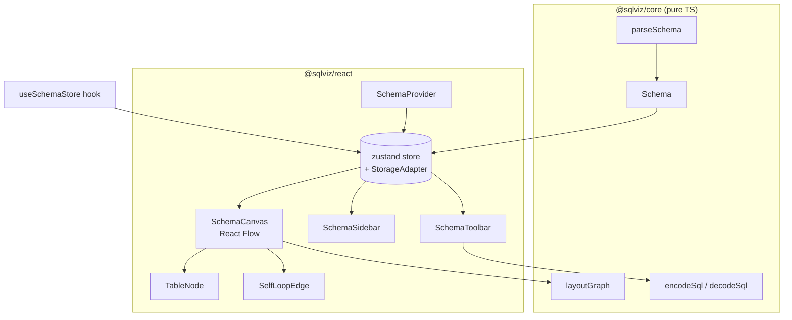

# @sqlviz/react

**Composable React components for SQL database schema visualization.** Drop an interactive ER diagram into any React app — paste DDL, get tables, foreign-key edges, search, collapse, comments, theming, PNG export and shareable URLs. Built on [React Flow](https://reactflow.dev) and [`@sqlviz/core`](https://www.npmjs.com/package/@sqlviz/core).

[](https://react.dev) [](#) [](#)

> Live demo: **[khanakia.github.io/sql-schema-visualizer](https://khanakia.github.io/sql-schema-visualizer/)** — the demo app is itself a thin consumer of this package.

---

## Install

```bash
npm i @sqlviz/react @sqlviz/core @xyflow/react react react-dom
```

`react`, `react-dom` and `@xyflow/react` are **peer dependencies**. Import the stylesheet once:

```ts
import '@sqlviz/react/styles.css'
```

## One line

```tsx
import { SchemaVisualizer } from '@sqlviz/react'
import '@sqlviz/react/styles.css'

export default function App() {
  return (
    <div style={{ height: '100vh' }}>
      <SchemaVisualizer sql="CREATE TABLE users ( id int PRIMARY KEY );" />
    </div>
  )
}
```

`<SchemaVisualizer>` props: `sql?`, `theme?: 'dark'|'light'`, `showSidebar?`, `showToolbar?`, `storage?`, `className?`.

## Compose your own

Every piece is exported so you control the layout entirely — sidebar, canvas and toolbar are independent and all read the shared store.

```tsx
import {
  SchemaProvider, SchemaCanvas, SchemaSidebar, SchemaToolbar,
  useSchemaStore,
} from '@sqlviz/react'
import '@sqlviz/react/styles.css'

function MyDiagram() {
  const tableCount = useSchemaStore(s => s.schema.tables.length)
  return (
    <SchemaProvider sql={mySql} theme="dark">
      <header>{tableCount} tables</header>
      <div style={{ display: 'flex', height: '90vh' }}>
        <SchemaSidebar />
        <div style={{ position: 'relative', flex: 1 }}>
          <SchemaCanvas showToolbar={false} />
          <SchemaToolbar onFit={() => {}} onExport={() => {}} />
        </div>
      </div>
    </SchemaProvider>
  )
}
```

## Architecture



## Public API

| Export | What |
|---|---|
| `<SchemaVisualizer>` | one-line full app (provider + sidebar + canvas + toolbar) |
| `<SchemaProvider>` | context wrapper — drive `sql` / `theme` / `storage` from props |
| `<SchemaCanvas showToolbar?>` | the React Flow diagram (pan/zoom/drag, minimap, measured layout) |
| `<SchemaSidebar>` | search, table list, SQL import, samples |
| `<SchemaToolbar>` | layout dir, collapse-all, comments, reset, fit, PNG, theme, share |
| `<TableNode>` / `<SelfLoopEdge>` | renderers for custom React Flow setups |
| `useSchemaStore` | full zustand store (sql, schema, search, focus, collapsed, theme, …) |
| `buildShareUrl`, `SHARE_URL_SOFT_LIMIT` | compressed share-link helpers |
| `setStorageAdapter`, `StorageAdapter` | pluggable persistence |
| re-exported core | `parseSchema`, `layoutGraph`, `encodeSql`, `decodeSql`, `samples`, types |

## Pluggable storage

Persistence (last SQL, theme, comment mode) defaults to `localStorage`, **auto-falls back to in-memory** when blocked/SSR. Bring your own backend:

```tsx
import { setStorageAdapter } from '@sqlviz/react'

setStorageAdapter({
  getItem: (k) => myKV.get(k) ?? null,
  setItem: (k, v) => myKV.set(k, v),
})
// …or per-instance: <SchemaProvider storage={adapter}> (swaps + re-hydrates, no flash)
```

## Theming

Dark/light via CSS custom properties on `:root[data-theme]` (toggled by the store). Override the tokens to reskin:

```css
:root[data-theme='dark'] { --accent: #a855f7; --surface: #14151b; /* … */ }
```

## Navigation

Figma-style: two-finger / trackpad scroll **pans**, ⌘/Ctrl+scroll **zooms**, double-click zooms in, drag pans. Search filters by table *or* column; click-to-navigate centers a table without disturbing zoom on Reset.

## License

[MIT](https://github.com/khanakia/sql-schema-visualizer/blob/main/LICENSE) © khanakia · Part of [sql-schema-visualizer](https://github.com/khanakia/sql-schema-visualizer).
