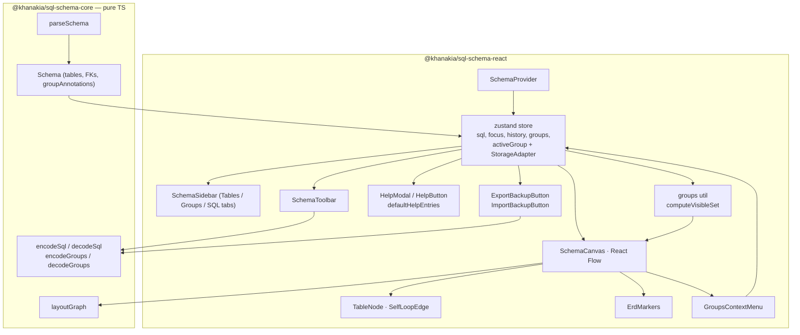

# @khanakia/sql-schema-react

**Composable React components for SQL database schema visualization.** Drop an interactive ER diagram into any React app — paste DDL, get tables, crow's-foot foreign-key edges, search, follow-the-FK navigation, table groups (sidebar + `-- @group:` SQL annotations), bulk multi-select, collapse, comments, theming, PNG export, shareable URLs, JSON backup/restore, and a searchable help modal. Built on [React Flow](https://reactflow.dev) and [`@khanakia/sql-schema-core`](https://www.npmjs.com/package/@khanakia/sql-schema-core).

[](https://react.dev) [](#) [](#)

> Live demo: **[khanakia.com/apps/sql-schema-visualizer/](https://khanakia.com/apps/sql-schema-visualizer/)** — the demo app is itself a thin consumer of this package.

---

## Install

```bash
npm i @khanakia/sql-schema-react @khanakia/sql-schema-core @xyflow/react react react-dom
```

`react`, `react-dom` and `@xyflow/react` are **peer dependencies**. Import the stylesheet once:

```ts
import '@khanakia/sql-schema-react/styles.css'
```

## One line

```tsx
import { SchemaVisualizer } from '@khanakia/sql-schema-react'
import '@khanakia/sql-schema-react/styles.css'

export default function App() {
  return (
    <div style={{ height: '100vh' }}>
      <SchemaVisualizer sql="CREATE TABLE users ( id int PRIMARY KEY );" />
    </div>
  )
}
```

`<SchemaVisualizer>` props: `sql?`, `theme?: 'dark'|'light'`, `showSidebar?`, `showToolbar?`, `storage?`, `className?`.

## Compose your own

Every piece is exported so you control the layout entirely — sidebar, canvas and toolbar are independent and all read the shared store.

```tsx
import {
  SchemaProvider, SchemaCanvas, SchemaSidebar, SchemaToolbar,
  useSchemaStore,
} from '@khanakia/sql-schema-react'
import '@khanakia/sql-schema-react/styles.css'

function MyDiagram() {
  const tableCount = useSchemaStore(s => s.schema.tables.length)
  return (
    <SchemaProvider sql={mySql} theme="dark">
      <header>{tableCount} tables</header>
      <div style={{ display: 'flex', height: '90vh' }}>
        <SchemaSidebar />
        <div style={{ position: 'relative', flex: 1 }}>
          <SchemaCanvas showToolbar={false} />
          <SchemaToolbar onFit={() => {}} onExport={() => {}} />
        </div>
      </div>
    </SchemaProvider>
  )
}
```

## Architecture



## Public API

Three levels — use whichever fits:

| Export | What |
|---|---|
| `<SchemaVisualizer>` | one-line full app (provider + sidebar + canvas + toolbar) |
| `<SchemaProvider>` | context wrapper — drive `sql` / `theme` / `storage` from props |
| `<SchemaCanvas>` | the React Flow diagram — fully prop-configurable (see below) |
| `<SchemaSidebar>` | bundled panel with four tabs (Tables / Groups / 📖 Notes / SQL); resizable right edge (drag); props `width` (locks the width when set) / `className` / `showHeader` / `resizable` |
| `<DocDrawer>` | slide-in right-side drawer that renders a single `/* @doc */` markdown body. Auto-mounted inside `<SchemaCanvas>`; mount it yourself only if you compose a custom canvas without `<SchemaCanvas>`. Triggered by clicks on the 📖 / 📝 badges (store.openDocDrawer). |
| `<SchemaToolbar>` | bundled floating toolbar (`onFit`, `onExport`, `className`) |
| `<TableNode>` / `<SelfLoopEdge>` | renderers for custom React Flow setups |
| `<ErdMarkers>` + `ERD_MARKER_ONE` / `ERD_MARKER_MANY_MANDATORY` / `ERD_MARKER_MANY_OPTIONAL` | SVG `<defs>` for crow's-foot line ends + id constants; drop next to your custom `<ReactFlow>` |
| `<GroupsContextMenu>` | right-click "Groups ▸" submenu (single + bulk multi-select); controlled via `x`/`y`/`tableIds`/`onClose` |
| `<HelpModal>` / `<HelpButton>` + `defaultHelpEntries`, `matchHelpEntry`, type `HelpEntry` | searchable "every feature" modal; pass `entries` to extend or fully replace |
| `<ExportBackupButton>` / `<ImportBackupButton>` + `buildBackup` / `validateBackup` / `applyBackup` / `downloadBackup`, types `BackupPayload` / `BackupApplyActions` | full-state JSON snapshot (SQL + groups + preferences) |
| **Toolbar primitives** | `ToolbarButton` `ToolbarDivider` `SamplesMenu` `BackButton` `ActiveGroupPill` `LayoutDirectionButton` `CollapseAllButton` `CommentModeButton` `ResetLayoutButton` `ThemeButton` `ShareButton` `FitButton` `ExportButton` `HelpButton` |
| **Sidebar primitives** | `SchemaSearch` `SchemaWarnings` `TableList` `SqlImport` `GroupsPanel` `NotesPanel` `CollapseSidebarButton` |
| `renderMarkdown(src)` | tiny safe markdown → React renderer (no deps). Used by the 📖 / 📝 popovers, the Notes tab, and the DocDrawer. |
| `useSchemaStore` | full zustand store (sql, schema, search, focus, history, collapsed, theme, groups, activeGroup, sidebarWidth, sidebarTab, docDrawer, …) |
| `useSchemaActions` | stable-ref object of just the action funcs (mutate-only callers — no re-render on unrelated state changes) |
| `computeVisibleSet(schema, groups, activeGroup)` / `edgeIsVisible(set, src, tgt)` | pure helpers behind group-filtered canvases |
| `buildShareUrl(sql, {groups?, activeGroup?})`, `SHARE_URL_SOFT_LIMIT` | compressed share-link helpers |
| `setStorageAdapter`, `StorageAdapter` | pluggable persistence (used for SQL, groups, theme, comment mode — versioned key `dbviz.groups.v1`) |
| re-exported core | `parseSchema`, `layoutGraph`, `encodeSql`, `decodeSql`, `encodeGroups`, `decodeGroups`, `samples`, types (`Schema` now includes `groupAnnotations`) |

Every visible part is store-driven and layout-headless — drop primitives anywhere.

### `<SchemaCanvas>` props

| Prop | Type | Default | |
|---|---|---|---|
| `showToolbar` | `boolean` | `true` | bundled floating toolbar |
| `showMinimap` | `boolean` | `true` | minimap |
| `showControls` | `boolean` | `true` | zoom controls |
| `showBackground` | `boolean` | `true` | dotted background |
| `showHint` | `boolean` | `true` | pan/zoom hint chip |
| `minZoom` / `maxZoom` | `number` | `0.05` / `2.5` | zoom bounds |
| `fitViewPadding` | `number` | `0.15` | fit-view padding |
| `panOnScroll` | `boolean` | `true` | scroll pans (Figma-style) |
| `zoomOnScroll` | `boolean` | `false` | scroll zooms instead |
| `zoomOnDoubleClick` | `boolean` | `true` | |
| `panOnDrag` | `boolean` | `true` | |
| `onTableClick` | `(table: string) => void` | – | fires on node click |
| `className` / `style` | – | – | wrapper styling |
| `reactFlowProps` | `object` | – | **escape hatch** — spread onto the underlying `<ReactFlow>`, overrides any default |

### Build your own toolbar / sidebar

```tsx
import {
  SchemaProvider, SchemaCanvas,
  // toolbar primitives
  ToolbarButton, ToolbarDivider, SamplesMenu, BackButton, ActiveGroupPill,
  LayoutDirectionButton, CommentModeButton, ResetLayoutButton,
  ThemeButton, ShareButton, HelpButton,
  // sidebar primitives
  SchemaSearch, TableList, GroupsPanel, SqlImport,
  // backup primitives
  ExportBackupButton, ImportBackupButton,
} from '@khanakia/sql-schema-react'

<SchemaProvider sql={mySql}>
  <aside style={{ width: 280 }}>
    <SchemaSearch placeholder="Find a table…" />
    <GroupsPanel />
    <TableList />
    <SqlImport />
    <ExportBackupButton /> <ImportBackupButton />
  </aside>

  <SchemaCanvas showToolbar={false} onTableClick={(t) => log(t)} />

  <div className="my-toolbar">
    <SamplesMenu />
    <ToolbarDivider />
    <BackButton />          {/* pops FK-navigation history */}
    <ActiveGroupPill />     {/* shows + clears the active group filter */}
    <LayoutDirectionButton />
    <CommentModeButton />
    <ResetLayoutButton />
    <ShareButton />
    <ThemeButton />
    <HelpButton />          {/* searchable "every feature" modal */}
    <ToolbarButton onClick={save}>💾 Save</ToolbarButton>
  </div>
</SchemaProvider>
```

## Table groups

A **group** is a named subset of tables; activating one filters the canvas to just its members (with the edges between them). Two coexisting sources, same UI:

- **User-managed** — created via the sidebar `+ New`, right-click `Groups ▸` menu, or `useSchemaActions().createGroup(name)`. Editable; persisted in `localStorage` under `dbviz.groups.v1`; travel in shared URLs as an additive `&g=` fragment.
- **SQL-derived** — annotate a `CREATE TABLE` with `-- @group: name` (or `-- @group: a, b` for multi-membership). The parser surfaces these on `schema.groupAnnotations`. They appear in the sidebar with a 📌 + `SQL` badge, read-only — change membership by editing SQL.

```tsx
import { useSchemaStore, useSchemaActions, computeVisibleSet } from '@khanakia/sql-schema-react'

const { createGroup, addToGroup, setActiveGroup } = useSchemaActions()
createGroup('billing')
addToGroup('billing', ['invoices', 'subscriptions'])
setActiveGroup('billing')   // canvas now shows just those two

// Compute the visible set yourself (e.g. inside a custom canvas)
const visible = computeVisibleSet(schema, groups, activeGroup)  // Set<string> | null
```

## Descriptions & notes (`/* @doc */`)

Multi-paragraph markdown descriptions for tables and columns live directly in SQL via `/* @doc … */` blocks — parsed into `Schema.Table.description` / `Schema.Column.description`. The UI exposes them three ways:

- **📖 / 📝 badges** on the table header / column row. Hover → portal-rendered preview popover; click → opens the slide-in `<DocDrawer />` for full-screen reading.
- **Notes sidebar tab** with two modes:
  - *By table* — dropdown picks a table, shows table + per-column descriptions; auto-tracks the focused table.
  - *📝 All field notes (N)* — every column-level `@doc` across the schema in one filterable list. Each entry has a click-to-focus link (centers the column on the canvas) and a ⤢ open-in-drawer button.
- **Sidebar search** (`<SchemaSearch />`) matches `@doc` body text as well as column names + short `--` comments, so typing a phrase from any description surfaces the right column.

Store actions:
```ts
useSchemaStore.getState().openDocDrawer({ kind: 'table', table: 'users', body: '# users\n…' })
useSchemaStore.getState().openDocDrawer({ kind: 'column', table: 'users', column: 'email', body: '…' })
useSchemaStore.getState().closeDocDrawer()
useSchemaStore.getState().setSidebarTab('notes')
useSchemaStore.getState().setSidebarWidth(420)      // 240–700, persisted
```

`<DocDrawer />` is mounted automatically inside `<SchemaCanvas />`. If you compose your own canvas without `<SchemaCanvas />`, mount `<DocDrawer />` once at your root.

## FK navigation

Click the **`↗`** glyph on any FK column row (or click the relationship edge itself) to follow the foreign key — the canvas centers on the referenced table and highlights the matching PK column. A 50-entry history stack lets you pop back via the toolbar `← Back` button, or **`⌥/Alt + ←`** / **`⌘/Ctrl + [`** keyboard shortcuts. Entirely store-driven via `focusTable` + `back` actions; works the same in custom canvases.

## Help modal

`<HelpButton />` (also bound to **`?`** globally) opens `<HelpModal />` — a searchable list of every feature grouped by section (Navigation, Multi-select & groups, Reading the diagram, Schema input, Output & sharing, Backup, Look & feel). Pass `entries` to either component to extend or fully replace `defaultHelpEntries`:

```tsx
import { HelpButton, defaultHelpEntries, type HelpEntry } from '@khanakia/sql-schema-react'

const extra: HelpEntry[] = [
  { id: 'mine', section: 'Custom', title: 'Our internal feature', body: '…' },
]
<HelpButton entries={[...defaultHelpEntries, ...extra]} />
```

## Backup

`<ExportBackupButton />` downloads a JSON snapshot of **SQL + groups + active group + comment mode + theme** (versioned via `BACKUP_VERSION`); `<ImportBackupButton />` re-applies one with confirmation. For custom UIs (POST to a backend, save to IndexedDB, scheduled exports) use the pure helpers directly:

```tsx
import { buildBackup, validateBackup, applyBackup, useSchemaStore, useSchemaActions } from '@khanakia/sql-schema-react'

const snap = buildBackup(useSchemaStore.getState(), 'before-refactor')
await fetch('/api/snapshots', { method: 'POST', body: JSON.stringify(snap) })

// Later:
const result = validateBackup(await (await fetch('/api/snapshots/123')).json())
if (result.ok) applyBackup(result.payload, useSchemaActions(), 'dark', 'inline', currentGroupNames)
```

## Custom canvas with crow's-foot markers

If you compose your own `<ReactFlow>` instead of using `<SchemaCanvas>`, mount `<ErdMarkers />` next to it once and point your edges at the exported marker-id constants:

```tsx
import { ErdMarkers, ERD_MARKER_ONE, ERD_MARKER_MANY_MANDATORY } from '@khanakia/sql-schema-react'

<>
  <ErdMarkers />
  <ReactFlow edges={[{ id, source, target, markerStart: ERD_MARKER_MANY_MANDATORY, markerEnd: ERD_MARKER_ONE }]} … />
</>
```

Color-coded by role to match the in-table glyphs: blue ≺ = FK / many side; amber │▶ = PK / one side; an extra circle in front of the foot means nullable FK.

## Pluggable storage

Persistence (last SQL, theme, comment mode) defaults to `localStorage`, **auto-falls back to in-memory** when blocked/SSR. Bring your own backend:

```tsx
import { setStorageAdapter } from '@khanakia/sql-schema-react'

setStorageAdapter({
  getItem: (k) => myKV.get(k) ?? null,
  setItem: (k, v) => myKV.set(k, v),
})
// …or per-instance: <SchemaProvider storage={adapter}> (swaps + re-hydrates, no flash)
```

## Theming

Dark/light via CSS custom properties on `:root[data-theme]` (toggled by the store). Override the tokens to reskin:

```css
:root[data-theme='dark'] { --accent: #a855f7; --surface: #14151b; /* … */ }
```

## Navigation

Figma-style: two-finger / trackpad scroll **pans**, ⌘/Ctrl+scroll **zooms**, double-click zooms in, drag pans. Search filters by table *or* column; click-to-navigate centers a table without disturbing zoom on Reset.

**Multi-select** on the canvas: **Shift-click** or **⌘/Ctrl-click** tables, or drag a rubber-band rectangle on the pane background. Right-click any selected node → `Groups ▸` submenu acts on the whole selection in one shot (bulk add to / remove from a group, or create a new group containing them all).

**FK navigation**: click the `↗` on any FK column row, or click the relationship edge itself, to jump to the referenced table; canvas centers and highlights the matching PK column. Back: toolbar `← Back` button, or `⌥/Alt + ←` / `⌘/Ctrl + [`. History stack capped at 50 entries.

**Keyboard shortcuts** (summary): `?` opens help · `⌥/Alt + ←` and `⌘/Ctrl + [` back · `Esc` closes modals · `/` focuses search in help · `Backspace/Delete` deletes the selected node (React Flow default).

## License

[MIT](https://github.com/khanakia/sql-schema-visualizer/blob/main/LICENSE) © khanakia · Part of [sql-schema-visualizer](https://github.com/khanakia/sql-schema-visualizer).
